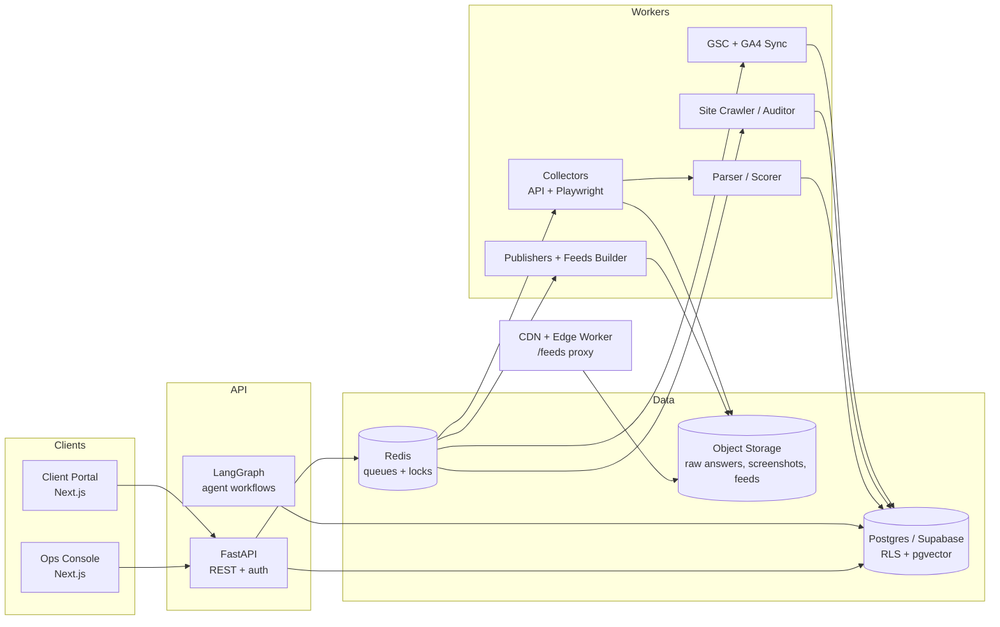
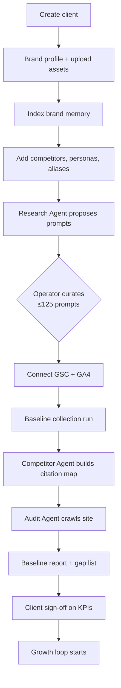
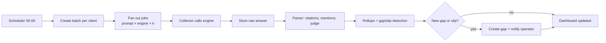
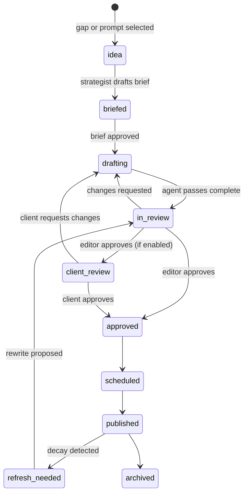
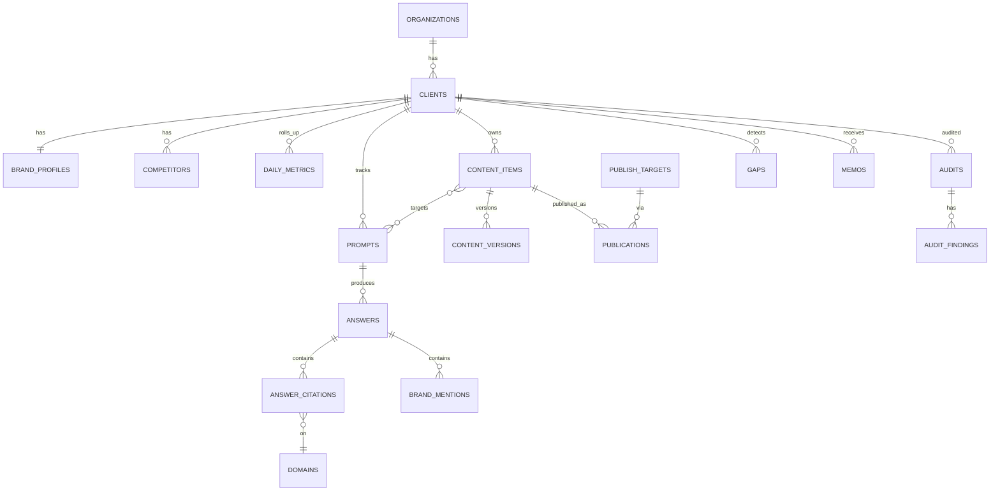

# Footnote — Product & Engineering Docs

*Working name. A managed SEO + AEO/GEO platform: track how brands appear in AI answers and Google, then run the content, technical, and off-site work that improves it. Modeled on the Unveilr operating model (managed service powered by internal agents and tooling).*

**Contents:** 1. PRD · 2. TRD · 3. Implementation Plan · 4. App Flow · 5. Schema

---

# 1. Product Requirements Document (PRD)

## 1.1 Summary

Footnote helps brands become the answer that ChatGPT, Gemini, Perplexity, Claude, Grok and Google AI Overviews recommend, and turns that visibility into leads. It combines:

1. A **measurement layer** that tracks a fixed set of buyer prompts across AI engines daily, plus Google Search Console and GA4.
2. An **agent-assisted production layer** (research, audit, content, publish, refresh, competitor, outreach) with **human approval gates**.
3. A **reporting layer** that produces dashboards and a human-reviewed monthly memo.

**Positioning:** a managed service first, with software as operational leverage. Clients buy outcomes (citations, rankings, leads); operators use the console to serve many clients with a small team. A self-serve tier is a later option.

## 1.2 Problem

- Buyers increasingly research inside AI answers. Brands don't know whether they appear, which sources the engines trust, or why a competitor is recommended instead.
- Existing SEO tools measure Google rankings, not AI citations. Existing AI-visibility trackers are dashboards that leave the work to the customer.
- SEO and AEO share most of their levers (content, entity signals, technical foundation) but are sold and run separately.

## 1.3 Goals and non-goals

**Goals (v1)**

- G1. Daily, evidence-backed measurement of brand visibility, citation share and share of voice per prompt, per engine.
- G2. A repeatable monthly loop: gap detection → brief → draft → approval → publish → measure → refresh.
- G3. One operator can run 8–10 clients at a time without losing quality.
- G4. Client-facing proof: dashboard, methodology page, and a monthly memo that ties metrics to work shipped.
- G5. Hosting for clients with no CMS (Feeds) so publishing is never blocked.

**Non-goals (v1)**

- Fully autonomous publishing, outreach or forum posting. Humans approve everything that leaves the building.
- Paid ads, social management, or general-purpose SEO suite features (rank tracker for thousands of keywords, backlink index).
- Guaranteeing outcomes or claiming causation from correlated metrics.

## 1.4 Users

| Persona | Needs | Primary surfaces |
| --- | --- | --- |
| **Operator / strategist** | Calibrate a client, see gaps, direct agents, approve work, write the memo | Ops console |
| **Editor** | Review and fix drafts fast, keep brand voice, check facts | Content workspace |
| **Client approver** (founder / marketing lead) | See results, approve briefs and drafts, know what shipped | Client portal |
| **Client viewer** | Read-only reporting | Client portal |
| **Org admin** | Users, clients, integrations, billing, audit log | Admin |

## 1.5 Scope by release

**P0 — MVP (weeks 1–8)**

- Client + brand memory setup; competitors, personas, aliases
- Prompt set builder (up to 125/client) with lead-intent scoring
- Collection: API adapters for ChatGPT, Gemini, Perplexity, Grok; Claude optional
- Parser: citations, brand/competitor mentions, sentiment, linked vs unlinked
- Metrics: visibility, citation share, share of voice, domain citation ranking
- GSC and GA4 sync; AI-referral detection
- Competitor citation map and gap list
- Site audit (schema, meta, robots/AI crawlers, llms.txt, sitemap, speed)
- Operator dashboard + client dashboard (read-only)

**P1 — v1.0 (weeks 9–12)**

- Content pipeline: brief → three-pass draft (strategist/writer/editor) → approval → publish
- WordPress publisher; Feeds (hosted static content at client path)
- Approval workflow in client portal
- Monthly memo generator (auto-metrics + human edit)

**P2 — v1.1+**

- Refresh agent (decay detection + rewrite proposals)
- Outreach agent (target discovery + drafts + approval)
- Third-party task board (Reddit/Quora) for human posting
- UI-based collection for engines where API results diverge
- New-model-release detection and re-baselining
- Webflow/Shopify/Ghost publishers; Google AI Overviews tracking
- Self-serve tier, agency white-label

## 1.6 Functional requirements

**Clients and brand memory**

- FR-1. Create a client with domain, industry, country and engine list.
- FR-2. Capture brand profile: voice, positioning, products, ICP, proof points (studies, certifications), banned claims, theme HTML/CSS.
- FR-3. Ingest documents and URLs into searchable brand memory (chunked + embedded).
- FR-4. Maintain brand aliases and competitor lists with aliases for detection.

**Prompts**

- FR-5. Generate candidate prompts from seed inputs (brand, competitors, personas, GSC queries) and let operators accept, edit, or retire them.
- FR-6. Score each prompt for lead intent and tag funnel stage and persona.
- FR-7. Enforce a per-client cap (default 125) and keep history when prompts are retired.

**Collection and measurement**

- FR-8. Run each active prompt on each selected engine on a fixed daily schedule, k runs per prompt (default 3).
- FR-9. Store raw response, parsed citations, and (for UI mode) a screenshot.
- FR-10. Compute and display, per day and engine: visibility, mention rate, linked rate, citation share, share of voice, sentiment.
- FR-11. Show per-prompt history with every answer's citations and mentions.
- FR-12. Show domain citation ranking vs competitors and classify domains (owned, competitor, forum, review site, wiki, news).
- FR-13. Flag *slipped* prompts (previously visible, now not) and *gaps* (competitor cited, brand absent).

**Search analytics**

- FR-14. Connect GSC and GA4 via OAuth; sync daily clicks, impressions, position, queries, and AI-referral sessions.
- FR-15. Attribute sessions from AI engines using referrer patterns; surface that this undercounts.

**Audit**

- FR-16. Crawl the client site and report schema, meta, canonicals, robots rules for AI crawlers, `llms.txt`, sitemap, and page speed.
- FR-17. Mark each finding as fixable by us or needing a client developer, and export a PR-ready brief.

**Content**

- FR-18. Create briefs mapped to one or more prompts; require sources and specific claims.
- FR-19. Generate drafts through separate strategist, writer and editor passes grounded in brand memory and cited sources.
- FR-20. Version every draft; track agent vs human edits.
- FR-21. Approval gates for briefs and drafts (operator, then client if enabled).
- FR-22. Publish to WordPress or Feeds with JSON-LD and metadata; record the live URL.
- FR-23. Scheduled refresh scan: flag content whose citations dropped, GSC clicks fell, or claims are stale; propose a diff for approval.

**Feeds**

- FR-24. Host per-client static pages at the client's domain path (or subdomain fallback) with sitemap, JSON-LD, and brand theme.

**Off-site**

- FR-25. Maintain a task board for Reddit/Quora/forum work: thread, brief, human-written draft, posted URL.
- FR-26. Outreach targets with rationale, contact, and drafted messages that cannot send without approval.

**Reporting and ops**

- FR-27. Monthly memo: auto-filled metrics, agent-drafted narrative, human edit, publish to client.
- FR-28. Public methodology entries for every number used in marketing.
- FR-29. Audit log of approvals, publishes and sends. Per-client agent cost tracking.

## 1.7 Metric definitions

| Metric | Definition |
| --- | --- |
| Run | One execution of (prompt, engine, run_index) at a time |
| Prompt visible (day, engine) | Brand mentioned in ≥ 50% of that day's runs for that prompt/engine |
| Visibility % | visible prompts ÷ tracked prompts, per engine and overall |
| Mention rate | runs with a brand mention ÷ total runs |
| Linked rate | mentions with a link to the brand domain ÷ mentions |
| Citation share | brand-domain citations ÷ all citations across tracked prompts (category-level) |
| Share of voice | brand mentions ÷ (brand + competitor mentions) |
| Gap | prompt where a competitor is mentioned/cited and the brand is not |
| Slipped | prompt visible in previous 7-day window, not in current |

Always display run counts and confidence caveats; engines are non-deterministic.

## 1.8 Success metrics (for the product)

- Time to onboard a client through calibration ≤ 10 working days.
- Operator capacity: 8+ active clients per strategist at steady state.
- Draft acceptance without major rewrite ≥ 60%.
- ≥ 95% of scheduled collection runs complete daily.
- Client-visible: ≥ 1 measurable visibility or citation-share lift per client within 90 days (tracked, not promised).

## 1.9 Risks and open questions

| Risk | Mitigation |
| --- | --- |
| Engine UI scraping violates terms and is brittle | Start on official APIs with search/grounding; add UI capture selectively; store raw responses; review terms with counsel |
| API answers differ from consumer UI | Calibrate by sampling both; label mode on every run |
| Mass-produced content triggers spam policies | Cap volume per client; require real proof points and sources; human editor pass |
| Undisclosed Reddit/Quora promotion | Disclosure rule in the task board; humans only |
| Overclaiming causality | Methodology page, "what we don't claim" section, show windows and sample sizes |
| Run-to-run noise | k runs per prompt, trend lines over 7/28 days, not single readings |

**Open questions:** client-facing approvals by default or opt-in? Pricing unit (prompts, articles, or flat)? Which engines are mandatory in v1? Legal review of collection methods before the first paid client?

---

# 2. Technical Requirements Document (TRD)

## 2.1 Architecture



## 2.2 Technology choices

| Layer | Choice | Notes |
| --- | --- | --- |
| Frontend | Next.js (App Router), TypeScript, Tailwind, shadcn/ui, Recharts | Two route groups: `/ops`, `/portal` |
| API | FastAPI (Python 3.12), Pydantic v2 | JWT from Supabase Auth |
| Agents | LangGraph + provider SDKs (OpenAI, Anthropic, Gemini) | Checkpointed graphs with interrupt nodes for approvals |
| DB | Postgres (Supabase), pgvector, RLS | Schema in §5 |
| Queue / scheduler | Redis + Arq (or Celery), cron via worker scheduler | Idempotent jobs keyed by (client, prompt, engine, day, run_index) |
| Browser automation | Playwright (containerized) | Only for UI-mode collection |
| Storage | S3-compatible (R2/S3) | Raw answers, screenshots, built Feeds sites |
| Edge | Cloudflare Worker (or Nginx rule) | Proxies `client.com/feeds/*` to Feeds origin |
| Observability | Sentry, OpenTelemetry, Langfuse (LLM traces) | Cost per agent run recorded in `agent_runs` |
| Deploy | Docker; web on Vercel, API/workers on a container host | Separate worker pools for LLM, browser and crawl jobs |

## 2.3 Collection subsystem

**Adapter interface**

```python
class EngineAdapter(Protocol):
    engine: Engine
    mode: Literal["api", "ui"]
    async def ask(self, prompt: str, *, geo: str, run_index: int) -> RawAnswer: ...
# RawAnswer: text, citations[{url,title,position}], model_label, raw_json, screenshot_path?
```

**Modes**

- **API mode (default):** use each provider's search-enabled/grounded endpoint (OpenAI web search tool, Gemini grounding with Google Search, Perplexity Sonar, xAI search, Anthropic web search). Verify current model names and pricing at build time.
- **UI mode (P2):** Playwright sessions per engine with rotating India residential proxies, human-like pacing, screenshot capture, and a circuit breaker on CAPTCHAs or bans. Treat as fragile and terms-sensitive.
- Each `answers` row records `mode`, `model_label`, `geo`, `run_index`.

**Scheduling**

- One `collection_batches` row per (client, day). A scheduler fans out `answers` rows (prompts × engines × k) with jitter.
- Rate limits per provider via Redis token buckets; exponential backoff; dead-letter after 3 failures.
- Idempotency: unique key prevents double-runs; reruns allowed manually.

**Cost model** (verify live prices) `daily_calls = prompts × engines × k`. Example: 100 prompts × 4 engines × 3 runs = 1,200 calls/day ≈ 36,000/month per client. Multiply by per-call cost of each provider's search tool; add parser LLM cost. Offer fewer runs for lower tiers, and use k=1 for low-priority prompts.

## 2.4 Parsing and scoring

Pipeline per `answers` row:

1. **Citation extraction** from structured response fields; fall back to URL regex on text.
2. **Domain normalization** (strip subdomains where appropriate, canonical host); upsert `domains`; classify `domain_type` via rules + LLM fallback; mark `is_brand_owned` / `competitor_id`.
3. **Entity detection** using `brand_aliases` and `competitors.aliases` (case-insensitive, fuzzy via trigram, then LLM verification on ambiguous hits).
4. **LLM judge** (small, cheap model, structured output): is the brand *recommended*, position rank in the answer, sentiment, short excerpt.
5. Write `brand_mentions`, `answer_citations`; mark `parsed_at`.
6. Nightly rollup into `daily_metrics` and `domain_citation_daily`; gap and slip detection into `gaps`.

Quality controls: golden test set of 50 hand-labeled answers; judge agreement ≥ 90% before shipping prompt changes; store judge prompt version on each parse.

## 2.5 Agents

All agents are LangGraph graphs with typed state, persisted checkpoints, `agent_runs` logging, and **interrupt nodes** at every human gate.

| Agent | Inputs | Outputs | Gate |
| --- | --- | --- | --- |
| Research | seed, GSC queries, competitors, personas | scored prompt candidates | Operator accepts |
| Competitor | answers + citations | competitor page/domain map, gap briefs | Operator reviews |
| Audit | crawl results | findings + PR-ready dev brief | Operator triages |
| Content | brief, brand memory, sources | versions (strategist → writer → editor) | Editor, then client (optional) |
| Publishing | approved version | publication record + URL | Auto after approval |
| Refresh | decay signals | rewrite proposal (diff) | Editor approves |
| Outreach | citation domain map | targets + drafted messages | Operator approves each send |
| Memo | metrics + work log | narrative draft | Strategist edits and publishes |

**Content grounding rules**

- Answer in the first 2–3 sentences; specific claims with numbers and named sources.
- Claims must trace to a source URL or a client proof point; unsourced claims are flagged by the editor pass.
- JSON-LD generated per type (Article, FAQPage, Product where relevant).
- Respect `banned_claims`; never invent studies, certifications or testimonials.

## 2.6 Audit subsystem

- Crawler (async HTTP + sitemap discovery; Playwright only when JS rendering is required).
- Checks: status codes, canonicals, titles/meta, JSON-LD validity, Organization/sameAs consistency (entity drift), `robots.txt` rules for GPTBot, ClaudeBot, PerplexityBot, Google-Extended and others, `llms.txt` presence, sitemap coverage, PageSpeed Insights metrics.
- Findings are rule-coded so the same rule can be re-run to verify a fix.

## 2.7 Publishing and Feeds

**CMS publishers:** WordPress REST (application passwords) in P1; Webflow, Shopify, Ghost later. Credentials stored in `publish_targets.config_enc` (AES-256-GCM, key in KMS/secret manager).

**Feeds architecture**

1. On publish, a builder renders the client's pages to static HTML using the brand theme (`theme_html/css`), embeds JSON-LD, generates `sitemap.xml` and an index page, and uploads to `feeds/{client_id}/...` in object storage.
2. A CDN edge worker maps `https://client.com/feeds/*` → origin prefix (requires the client to add a path rule, or point a subdomain CNAME as fallback).
3. Cache purge on publish; `Cache-Control` tuned; `lastmod` in sitemap updates.
4. Pages are fully pre-rendered; no client-side rendering dependency.

## 2.8 Integrations

- **GSC:** OAuth, Search Analytics API (daily + query/page); also AI Overview filtered impressions where available. Backfill 90 days on connect.
- **GA4:** Data API; sessions by source/medium; maintain a regex list for AI referrers (chatgpt.com, perplexity.ai, gemini.google.com, claude.ai, grok, copilot) that is editable.
- Token refresh handled in sync worker; failures surface as an integration health badge.

## 2.9 Security and privacy

- Tenant isolation via RLS using `has_client_access()`; workers use a service role and always filter by `client_id`.
- Roles: owner, admin, strategist, editor (internal); client_approver, client_viewer (portal). Client roles are read-only plus approval actions.
- Encrypt OAuth tokens and CMS credentials at rest; never log them; scoped, revocable access.
- Signed URLs for screenshots and raw answers.
- Audit log for approvals, publishes, outreach sends, and permission changes.
- Data retention policy for raw answers and screenshots (default 12 months, configurable).
- Prompt-injection safety: treat fetched web content and answer text as untrusted data; agents cannot call publish or send tools without an approval record.

## 2.10 Non-functional requirements

| Area | Target |
| --- | --- |
| Collection reliability | ≥ 95% of scheduled runs complete within 6 h of start |
| Dashboard load | p95 \< 2 s for 90-day views (served from rollups) |
| Parse latency | \< 10 min after collection finishes |
| Availability | 99.5% for portal/API; workers degrade gracefully |
| Cost visibility | Per-client monthly LLM/collection spend visible to admins |
| Reproducibility | Every metric traceable to answer rows and prompt/judge versions |

## 2.11 Testing

- Unit tests for parsers, domain normalization and metrics math.
- Golden-set evaluation for the LLM judge and content grounding checks.
- Adapter contract tests with recorded fixtures; nightly canary prompt per engine to detect API/UI changes.
- E2E (Playwright) for approval flow and publish path using a WordPress sandbox.
- Load test: 20 clients × 125 prompts × 4 engines × 3 runs per day.

---

# 3. Implementation Plan

Assumes 1–2 developers plus you acting as operator for the first clients. Adjust if the team is larger.

## 3.1 Repo layout

```
footnote/
├─ apps/
│  ├─ web/            # Next.js: /ops and /portal route groups
│  └─ feeds-edge/     # Cloudflare Worker for /feeds proxy
├─ services/
│  ├─ api/            # FastAPI
│  ├─ workers/        # collectors, parsers, crawler, sync, publishers
│  └─ agents/         # LangGraph graphs + prompts (versioned)
├─ packages/
│  ├─ schemas/        # shared Pydantic/TS types
│  └─ evals/          # golden sets for judge + content checks
├─ db/migrations/
└─ infra/             # docker, CI, IaC
```

## 3.2 Phases

| Phase | Weeks | Deliverables | Definition of done |
| --- | --- | --- | --- |
| **0. Foundations** | 1 | Repo, CI, Supabase project, auth, orgs/clients/roles, RLS baseline, queue + scheduler skeleton | Operator can sign in, create a client; RLS test suite passes |
| **1. Measurement core** | 2–4 | Prompts CRUD, API adapters (3–4 engines), collection batches, parser (citations, mentions, judge), rollups, basic dashboards | A client's prompts run daily; dashboard shows visibility and citation share with drill-down to raw answers |
| **2. Analytics + gaps** | 5–6 | GSC/GA4 OAuth + sync, AI-referral detection, competitor citation map, gap/slip detection | Gap list generated from real data; GSC and GA4 charts match source UIs |
| **3. Audit + calibration UX** | 7–8 | Crawler/auditor, brand profile + memory ingest, prompt research agent, onboarding wizard, client read-only portal | New client can be calibrated end-to-end in the console; **MVP demoable to a first client** |
| **4. Content pipeline** | 9–10 | Briefs, 3-pass content agent, versioning, editor UI, approvals, WordPress publisher | An approved article publishes to WordPress with JSON-LD; mapped to prompts |
| **5. Feeds + memo** | 11–12 | Feeds builder + edge proxy, sitemap/cache purge, memo generator, methodology pages | A no-CMS client is live at `/feeds`; first monthly memo issued |
| **6. Refresh + off-site** | 13–15 | Refresh agent, third-party task board, outreach agent with approvals | Decay detected and a rewrite approved; outreach cannot send without approval |
| **7. Hardening** | 16+ | UI-mode collectors where needed, model-release detection, cost dashboards, retention jobs, additional CMS publishers | Reliability and cost targets in §2.10 met |

## 3.3 Task breakdown (Phases 0–3)

**Phase 0**

- Supabase auth, `organizations`, `org_members`, `clients`, `client_members`; RLS helper and tests
- FastAPI skeleton with JWT verification and tenant context
- Arq workers, scheduler, structured logging, Sentry
- Next.js app shell, role-aware routing

**Phase 1**

- `prompts` UI (table + import CSV); engine multiselect
- `EngineAdapter` + OpenAI, Gemini, Perplexity, xAI implementations; token-bucket rate limiter
- Batch fan-out with idempotency keys; failure handling and retries
- Domain normalization + classification service
- Mention/citation parser, LLM judge with versioned prompt, golden-set eval harness
- Nightly rollup SQL/jobs → `daily_metrics`, `domain_citation_daily`
- Dashboard: visibility by engine, citation share vs competitors, prompt table with sparkline, answer drawer

**Phase 2**

- Google OAuth, token encryption, GSC and GA4 sync workers, backfill
- Referrer regex config for AI sources
- Competitor map view (domain × prompt matrix), gap generation job, slip alerts
- Weekly digest email to operators

**Phase 3**

- Crawler, rule engine, findings UI, dev-brief export
- Brand profile forms, document upload → chunk → embed
- Research agent: candidate prompts → scoring → accept/edit queue
- Onboarding wizard and baseline report
- Client portal (read-only dashboards, methodology page)

## 3.4 Roles for the first 90 days

| Role | Who | Responsibility |
| --- | --- | --- |
| Product + backend | You | Architecture, agents, collection, schema |
| Frontend | You / contract | Ops console, portal |
| Strategist / editor | You or a hired editor | Calibration, approvals, memo, off-site posts |

## 3.5 First-client plan

1. Pick 1–2 pilot clients in a vertical you can speak to (e.g., D2C or professional services in India); offer a discounted pilot in exchange for a named case study.
2. Run the baseline report during sales as the demo (visibility, who is cited instead, audit findings).
3. Run the loop manually where the software isn't ready; log every manual step as a future automation.
4. Publish a methodology entry per client with window, sample size and instrument before using any number in marketing.

## 3.6 Milestone checklist

- [ ] M1 (wk 4): Daily tracking live for a pilot client
- [ ] M2 (wk 8): Baseline report + audit + dashboards → first sales demo
- [ ] M3 (wk 10): First approved article published
- [ ] M4 (wk 12): Feeds live; first monthly memo
- [ ] M5 (wk 15): Refresh and outreach loops working

---

# 4. App Flow

## 4.1 Screen map

**Ops console (`/ops`)**

- Clients list → Client home (health, KPIs, open gaps, pending approvals)
- Setup: Brand profile · Brand memory · Competitors · Personas · Integrations · Publish targets
- Prompts: set builder · prompt detail (history, citations, mentions)
- Tracking: visibility · citations & domains · competitors · slips & gaps · raw answers
- Audit: findings · fix status · dev brief
- Content: pipeline board · brief · editor (versions, diff, sources) · publish status
- Off-site: Reddit/Quora board · outreach
- Reports: monthly memo editor · exports · methodology entries
- Admin: users · roles · audit log · agent costs

**Client portal (`/portal`)**

- Overview · Visibility · Citations · Google performance · Content shipped · Approvals · Memos · Methodology

## 4.2 Onboarding and calibration flow



## 4.3 Daily measurement flow



## 4.4 Content lifecycle



## 4.5 Monthly loop

1. Review slips/gaps and prior-month performance.
2. Select prompts to target; create briefs.
3. Content agent drafts; editor reviews; approvals.
4. Publish (CMS or Feeds); verify live URL and schema.
5. Work off-site tasks and outreach (human-posted, approval-gated).
6. Refresh scan on aging or decaying pages.
7. Generate memo draft from metrics and work log; strategist edits and sends.

## 4.6 Approval rules

| Item | Approver | Notes |
| --- | --- | --- |
| Prompt set changes | Operator | History preserved |
| Brief | Operator (client optional) | Must list sources and target prompts |
| Draft | Editor (client optional) | Unsourced claims block approval |
| Refresh rewrite | Editor | Diff view required |
| Outreach message | Operator | One approval per message |
| Third-party post | Human author | Disclosure required |
| Memo | Strategist | Auto-numbers + human narrative |

## 4.7 Key empty and error states

- No GSC/GA4 connected: show tracking only, prompt to connect.
- Engine adapter failing: banner with last success time; exclude failed runs from rates and show run counts.
- Parser disagreement flag: low-confidence mentions get a review chip.
- Publish failure: retry with error text; draft stays approved.

---

# 5. Schema

The complete, runnable SQL is below (also delivered as `schema.sql`). Design notes:

- **Tenancy:** `organizations` → `clients`; everything client-scoped carries `client_id`, and RLS applies `has_client_access(client_id)` to all such tables automatically.
- **Evidence first:** `answers` stores the raw response and screenshot path; `answer_citations` and `brand_mentions` are derived and can be re-parsed when the judge changes.
- **Rollups:** dashboards read `daily_metrics` and `domain_citation_daily`, not raw rows.
- **Content versioning:** `content_items` point to `content_versions`; agent and human edits are both versions.
- **Secrets:** CMS and OAuth credentials are stored encrypted (`*_enc` columns).
- **Scale:** partition `gsc_query_daily` by month; consider partitioning `answers` by month after \~10M rows.



```sql
-- Footnote (working name) — Postgres 15+ / Supabase schema
-- Multi-tenant: organization (operator/agency) -> clients (brands) -> everything else

create extension if not exists pgcrypto;
create extension if not exists vector;
create extension if not exists pg_trgm;

-- ───────────── Enums ─────────────
create type engine_t         as enum ('chatgpt','gemini','perplexity','claude','grok','google_aio');
create type collect_mode_t   as enum ('api','ui');
create type member_role_t    as enum ('owner','admin','strategist','editor','client_approver','client_viewer');
create type content_status_t as enum ('idea','briefed','drafting','in_review','client_review','approved','scheduled','published','refresh_needed','archived');
create type approval_status_t as enum ('pending','approved','rejected','changes_requested');
create type domain_type_t    as enum ('owned','competitor','forum','review_site','wiki','news','publisher','marketplace','gov_edu','other');
create type sentiment_t      as enum ('positive','neutral','negative','mixed');
create type job_status_t     as enum ('queued','running','succeeded','failed','skipped');

-- ───────────── Tenancy ─────────────
create table organizations (
  id uuid primary key default gen_random_uuid(),
  name text not null,
  slug text unique not null,
  created_at timestamptz not null default now()
);

create table org_members (
  org_id uuid references organizations on delete cascade,
  user_id uuid not null,                       -- auth.users.id
  role member_role_t not null,
  primary key (org_id, user_id)
);

create table clients (
  id uuid primary key default gen_random_uuid(),
  org_id uuid not null references organizations on delete cascade,
  name text not null,
  primary_domain text not null,
  industry text,
  country text default 'IN',
  status text not null default 'onboarding',   -- onboarding | active | paused | churned
  settings jsonb not null default '{}',        -- schedules, run_count, geo, caps
  onboarded_at timestamptz,
  created_at timestamptz not null default now()
);

create table client_members (                   -- client-portal users
  client_id uuid references clients on delete cascade,
  user_id uuid not null,
  role member_role_t not null check (role in ('client_approver','client_viewer')),
  primary key (client_id, user_id)
);

-- ───────────── Brand memory ─────────────
create table brand_profiles (
  client_id uuid primary key references clients on delete cascade,
  voice text, positioning text,
  products jsonb default '[]', icp jsonb default '{}',
  proof_points jsonb default '[]',             -- studies, certifications, stats (client-supplied)
  banned_claims text[] default '{}',
  theme_html text, theme_css text,
  updated_at timestamptz default now()
);

create table brand_aliases (
  id uuid primary key default gen_random_uuid(),
  client_id uuid not null references clients on delete cascade,
  alias text not null, is_primary boolean default false
);

create table competitors (
  id uuid primary key default gen_random_uuid(),
  client_id uuid not null references clients on delete cascade,
  name text not null, domain text,
  aliases text[] default '{}'
);

create table personas (
  id uuid primary key default gen_random_uuid(),
  client_id uuid not null references clients on delete cascade,
  name text not null, description text
);

create table brand_memory_chunks (
  id uuid primary key default gen_random_uuid(),
  client_id uuid not null references clients on delete cascade,
  source text not null,                        -- brief | asset | site | study
  title text, content text not null,
  embedding vector(1536),
  created_at timestamptz default now()
);
create index on brand_memory_chunks using hnsw (embedding vector_cosine_ops);

-- ───────────── Prompts & collection ─────────────
create table prompts (
  id uuid primary key default gen_random_uuid(),
  client_id uuid not null references clients on delete cascade,
  text text not null,
  kind text not null default 'ai_prompt',      -- ai_prompt | keyword
  persona_id uuid references personas,
  funnel_stage text,                           -- awareness | consideration | decision
  lead_intent_score smallint check (lead_intent_score between 0 and 100),
  engines engine_t[] not null default '{chatgpt,gemini,perplexity,grok}',
  source text,                                 -- gsc | llm | paa | reddit | manual
  is_active boolean default true,
  created_at timestamptz default now(),
  retired_at timestamptz
);
create index on prompts (client_id, is_active);

create table collection_batches (
  id uuid primary key default gen_random_uuid(),
  client_id uuid not null references clients on delete cascade,
  scheduled_for date not null,
  status job_status_t not null default 'queued',
  started_at timestamptz, finished_at timestamptz,
  stats jsonb default '{}',
  unique (client_id, scheduled_for)
);

create table answers (
  id uuid primary key default gen_random_uuid(),
  batch_id uuid references collection_batches on delete cascade,
  client_id uuid not null references clients on delete cascade,
  prompt_id uuid not null references prompts,
  engine engine_t not null,
  mode collect_mode_t not null,
  run_index smallint not null default 1,       -- k-th repeat of same prompt that day
  geo text default 'IN',
  status job_status_t not null default 'queued',
  raw_text text, raw_json jsonb,
  screenshot_path text,
  model_label text,                            -- as reported/observed
  latency_ms int, error text,
  collected_at timestamptz,
  parsed_at timestamptz
);
create index on answers (client_id, prompt_id, engine, collected_at desc);

create table domains (
  id uuid primary key default gen_random_uuid(),
  domain text unique not null,
  domain_type domain_type_t default 'other',
  authority_score numeric,
  first_seen timestamptz default now()
);

create table answer_citations (
  id uuid primary key default gen_random_uuid(),
  answer_id uuid not null references answers on delete cascade,
  client_id uuid not null references clients on delete cascade,
  url text not null, title text,
  domain_id uuid references domains,
  position smallint,
  is_brand_owned boolean default false,
  competitor_id uuid references competitors
);
create index on answer_citations (client_id, domain_id);
create index on answer_citations (answer_id);

create table brand_mentions (
  id uuid primary key default gen_random_uuid(),
  answer_id uuid not null references answers on delete cascade,
  client_id uuid not null references clients on delete cascade,
  entity_kind text not null check (entity_kind in ('brand','competitor')),
  competitor_id uuid references competitors,
  rank_in_answer smallint,
  linked boolean default false,
  recommended boolean,
  sentiment sentiment_t,
  excerpt text
);
create index on brand_mentions (client_id, answer_id);

create table daily_metrics (
  client_id uuid references clients on delete cascade,
  day date, engine engine_t,
  prompts_tracked int, prompts_visible int,
  mention_rate numeric, linked_rate numeric,
  brand_citations int, total_citations int, citation_share numeric,
  share_of_voice numeric, avg_sentiment numeric,
  primary key (client_id, day, engine)
);

create table domain_citation_daily (
  client_id uuid references clients on delete cascade,
  day date, domain_id uuid references domains,
  citations int, is_brand boolean default false,
  primary key (client_id, day, domain_id)
);

create table gaps (
  id uuid primary key default gen_random_uuid(),
  client_id uuid not null references clients on delete cascade,
  prompt_id uuid references prompts,
  gap_type text not null,                      -- absent | competitor_cited | source_missing | slipped
  details jsonb default '{}',
  status text default 'open',                  -- open | in_progress | won | dismissed
  detected_at timestamptz default now(), closed_at timestamptz
);

-- ───────────── Site audit ─────────────
create table site_pages (
  id uuid primary key default gen_random_uuid(),
  client_id uuid not null references clients on delete cascade,
  url text not null, status_code int, title text,
  meta jsonb, jsonld jsonb, word_count int,
  content_hash text, last_crawled_at timestamptz,
  unique (client_id, url)
);

create table audits (
  id uuid primary key default gen_random_uuid(),
  client_id uuid not null references clients on delete cascade,
  started_at timestamptz default now(), finished_at timestamptz,
  score numeric, summary jsonb default '{}'
);

create table audit_findings (
  id uuid primary key default gen_random_uuid(),
  audit_id uuid not null references audits on delete cascade,
  client_id uuid not null references clients on delete cascade,
  category text not null,                      -- schema | meta | robots | llms_txt | sitemap | speed | entity
  severity text not null,                      -- critical | high | medium | low
  url text, rule text, detail text,
  fix_owner text default 'team',               -- team | client_dev
  status text default 'open'
);

-- ───────────── Content ─────────────
create table content_briefs (
  id uuid primary key default gen_random_uuid(),
  client_id uuid not null references clients on delete cascade,
  title text, angle text,
  outline jsonb, sources jsonb default '[]',
  created_by uuid, created_at timestamptz default now()
);

create table content_items (
  id uuid primary key default gen_random_uuid(),
  client_id uuid not null references clients on delete cascade,
  brief_id uuid references content_briefs,
  type text default 'article',                 -- article | faq | comparison | landing
  slug text, status content_status_t not null default 'idea',
  current_version_id uuid,
  publish_target_id uuid,
  published_url text, published_at timestamptz,
  last_refreshed_at timestamptz, decay_score numeric default 0,
  created_at timestamptz default now()
);

create table content_versions (
  id uuid primary key default gen_random_uuid(),
  content_item_id uuid not null references content_items on delete cascade,
  client_id uuid not null references clients on delete cascade,
  version_no int not null,
  title text, body_md text, body_html text,
  jsonld jsonb, meta jsonb,
  author_kind text not null,                   -- agent | human
  agent_run_id uuid,
  created_at timestamptz default now(),
  unique (content_item_id, version_no)
);

create table content_prompt_map (
  content_item_id uuid references content_items on delete cascade,
  prompt_id uuid references prompts on delete cascade,
  is_primary boolean default false,
  primary key (content_item_id, prompt_id)
);

create table approvals (
  id uuid primary key default gen_random_uuid(),
  client_id uuid not null references clients on delete cascade,
  subject_type text not null,                  -- brief | version | outreach | refresh | memo
  subject_id uuid not null,
  status approval_status default 'pending',
  requested_by uuid, reviewer_id uuid, comment text,
  requested_at timestamptz default now(), decided_at timestamptz
);

-- ───────────── Publishing & Feeds ─────────────
create table publish_targets (
  id uuid primary key default gen_random_uuid(),
  client_id uuid not null references clients on delete cascade,
  kind text not null,                          -- wordpress | webflow | shopify | ghost | feeds | webhook
  config_enc bytea,                            -- AES-256-GCM encrypted credentials
  status text default 'active'
);

create table feeds_sites (
  client_id uuid primary key references clients on delete cascade,
  mount_path text default '/feeds',
  custom_domain text, theme jsonb default '{}',
  origin_prefix text, last_build_at timestamptz
);

create table publications (
  id uuid primary key default gen_random_uuid(),
  content_item_id uuid not null references content_items on delete cascade,
  client_id uuid not null references clients on delete cascade,
  version_id uuid references content_versions,
  target_id uuid references publish_targets,
  external_id text, url text,
  status job_status_t default 'queued', error text,
  published_at timestamptz
);

create table refresh_proposals (
  id uuid primary key default gen_random_uuid(),
  content_item_id uuid not null references content_items on delete cascade,
  client_id uuid not null references clients on delete cascade,
  reason jsonb,                                -- {citation_loss, gsc_drop, stale_claims[], age_days}
  proposed_version_id uuid references content_versions,
  status text default 'pending', created_at timestamptz default now()
);

-- ───────────── Off-site work ─────────────
create table third_party_tasks (
  id uuid primary key default gen_random_uuid(),
  client_id uuid not null references clients on delete cascade,
  platform text not null,                      -- reddit | quora | forum | other
  target_url text, thread_title text,
  brief text, draft text,
  assignee uuid, status text default 'todo',
  posted_url text, due_at timestamptz
);

create table outreach_targets (
  id uuid primary key default gen_random_uuid(),
  client_id uuid not null references clients on delete cascade,
  domain_id uuid references domains,
  contact_name text, contact_email text,
  rationale text, status text default 'identified'
);

create table outreach_messages (
  id uuid primary key default gen_random_uuid(),
  target_id uuid not null references outreach_targets on delete cascade,
  client_id uuid not null references clients on delete cascade,
  subject text, body text,
  approval_id uuid references approvals,
  sent_at timestamptz, reply_status text
);

-- ───────────── Analytics sync ─────────────
create table integrations (
  id uuid primary key default gen_random_uuid(),
  client_id uuid not null references clients on delete cascade,
  provider text not null,                      -- gsc | ga4
  account_ref text, tokens_enc bytea,
  status text default 'active', last_synced_at timestamptz,
  unique (client_id, provider)
);

create table gsc_daily (
  client_id uuid references clients on delete cascade,
  day date, clicks int, impressions int, ctr numeric, position numeric,
  aio_impressions int,
  primary key (client_id, day)
);

create table gsc_query_daily (
  client_id uuid references clients on delete cascade,
  day date, query text, page text,
  clicks int, impressions int, position numeric,
  primary key (client_id, day, query, page)
) partition by range (day);
-- create monthly partitions via migration job

create table ga4_daily (
  client_id uuid references clients on delete cascade,
  day date, source text, medium text,
  sessions int, engaged_sessions int, conversions int,
  primary key (client_id, day, source, medium)
);

create table leads (
  id uuid primary key default gen_random_uuid(),
  client_id uuid not null references clients on delete cascade,
  occurred_at timestamptz not null,
  source text, landing_page text,
  attributed_content_id uuid references content_items,
  value numeric, raw jsonb
);

-- ───────────── Reporting, agents, ops ─────────────
create table memos (
  id uuid primary key default gen_random_uuid(),
  client_id uuid not null references clients on delete cascade,
  period_start date, period_end date,
  metrics jsonb, draft_md text, final_md text,
  status text default 'draft', published_at timestamptz
);

create table agent_runs (
  id uuid primary key default gen_random_uuid(),
  client_id uuid references clients on delete cascade,
  agent text not null,                         -- research | competitor | audit | content | publish | outreach | refresh | tracking | memo
  input jsonb, output jsonb,
  model text, tokens_in int, tokens_out int, cost_usd numeric(10,4),
  status job_status_t default 'queued',
  started_at timestamptz, finished_at timestamptz, trace_url text
);

create table model_release_events (
  id uuid primary key default gen_random_uuid(),
  engine engine_t not null, model_label text,
  detected_at timestamptz default now(), source_url text
);

create table audit_log (
  id bigserial primary key,
  org_id uuid, actor uuid, action text, entity text, entity_id uuid,
  meta jsonb, at timestamptz default now()
);

-- ───────────── RLS ─────────────
create or replace function has_client_access(cid uuid) returns boolean
language sql stable security definer as $$
  select exists (
    select 1 from clients c join org_members m on m.org_id = c.org_id
    where c.id = cid and m.user_id = auth.uid()
  ) or exists (
    select 1 from client_members cm where cm.client_id = cid and cm.user_id = auth.uid()
  );
$$;

-- Apply to every table that has a client_id column
do $$
declare r record;
begin
  for r in
    select table_name from information_schema.columns
    where table_schema = 'public' and column_name = 'client_id'
      and table_name not in ('clients')
  loop
    execute format('alter table %I enable row level security', r.table_name);
    execute format(
      'create policy tenant_access on %I using (has_client_access(client_id)) with check (has_client_access(client_id))',
      r.table_name);
  end loop;
end $$;

alter table clients enable row level security;
create policy org_clients on clients using (
  exists (select 1 from org_members m where m.org_id = clients.org_id and m.user_id = auth.uid())
  or exists (select 1 from client_members cm where cm.client_id = clients.id and cm.user_id = auth.uid())
);
-- NOTE: client_* roles should get read-only + approval-only policies in a follow-up migration;
-- the policy above is the baseline tenant boundary. Workers use the service role.
```